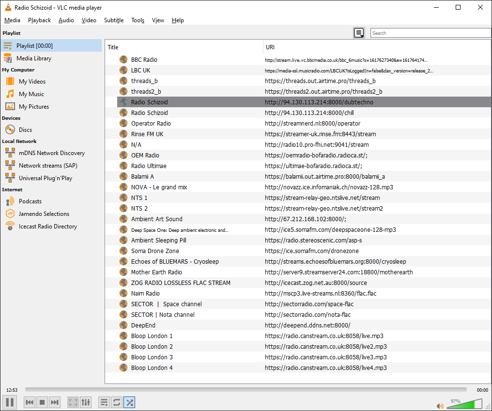

# internet-radio-streams

Open `vlc-internet-radio.xspf` in VLC media player, and you're streaming radio
without dealing with annoying websites, login pages, or location-based
copyright laws.

Navigate between stations with the up/down arrow keys, hit enter to play.



The playlist is grouped into sections — talk, underground and community radio,
dub techno, ambient, and lossless — using XML comments. VLC ignores them, but
note that if you ever re-save the playlist *from* VLC it will drop them.

## Levelling the volume between stations

Stations are mastered at wildly different loudness — around 25 LU between the
loudest and quietest here — so switching stations means reaching for the volume
knob. VLC's volume normaliser fixes this if you set it to act slowly.

Enable it once in VLC, under **Tools > Preferences > Audio**, by ticking
*Normalize volume to* — or set it directly in `vlcrc`:

```ini
audio-filter=normvol
norm-buff-size=200
norm-max-level=1.000000
```

`norm-buff-size` is the averaging window in buffers, and 200 is the maximum.
Large means slow: it corrects the loudness drift you get when a show or a DJ
changes, while leaving the dynamics inside the music alone. Shortening it makes
levelling faster and starts to sound like pumping. `norm-max-level` is the
threshold above which a loud stream is pulled down — lower levels more
aggressively, and the *Normalize volume to* box in the GUI is the same setting.

Close VLC before editing `vlcrc` by hand, or it will overwrite your changes
when it exits.

Two things are worth knowing:

- This cannot be stored in the playlist. VLC refuses audio filter and gain
  options that come from a playlist file — it logs `unsafe option ... has been
  ignored for security reasons` — for both XSPF `<vlc:option>` and M3U
  `#EXTVLCOPT`. It has to be a setting or a command-line option.
- A fixed per-station gain would not work anyway. These are live stations, so
  loudness moves when the show or the DJ changes. The normaliser tracks that
  drift; a hard-coded number would be wrong within the hour.

Note that `normvol` mostly *attenuates*: it pulls loud stations down rather
than lifting quiet ones up, so genuinely quiet stations stay quiet. It is also
a global VLC setting, so it applies to everything you play, films included. To
keep it to radio only, pass the same values on the command line instead of
saving them:

```sh
vlc --audio-filter=normvol --norm-buff-size=200 --norm-max-level=1.0 vlc-internet-radio.xspf
```

## Tools

| Script | What it does |
|---|---|
| `tools/check-streams.sh` | Checks every stream in the playlist still delivers audio |
| `tools/measure-loudness.sh` | Reports EBU R128 loudness, loudness range and true peak per stream |

`check-streams.sh` exists because stream rot is not obvious: a dead Icecast
mount will often still answer `200 OK` with an audio content-type and then send
nothing at all. Checking status codes alone will happily pass a silent stream,
so the script requires real audio bytes to arrive. It exits non-zero if
anything fails, and needs only `bash`, `curl` and `python`.

```sh
tools/check-streams.sh                      # defaults to the playlist in this repo
tools/measure-loudness.sh '' 60             # sample each stream for 60s (needs ffmpeg)
```

When a station fails, check whether the mount simply moved before removing it —
several here have changed host while keeping the same programming. Community
stations that vanished from `out.airtime.pro` are a common case; some
reappeared on other providers.
